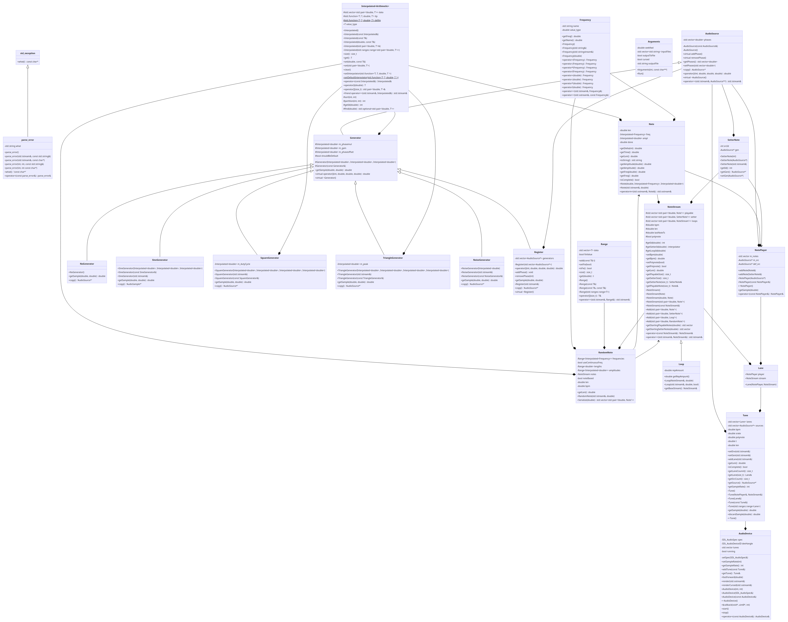

# l00pr

## Specification

An overcomplicated function generator / a very simple music player

### Dependencies
- `SDL`: for audio playing

### Usage
`l00pr [arguments] <file>`

#### Arguments

The arguments may be subject to change. Listed arguments are always available but their names may differ.

- `-h` / `--help`: Prints some info and the available arguments
- `-o <file>` / `--output <file>`: If specified, instead of playing the audio, the program puts the output into `file`. The format is always .wav, regardless of the extension

### File format

The file is mostly case-insensitive. The file consists of segments. One segment can span multiple lines. Each segment consists of a keyword and its corresponding arguments. Comments can be written using `#` and end at the line ending

Supported keywords:

- `set`
- `generator(s)`
- `player`

#### Set

A `set` statement sets file-wise arguments.

##### Syntax

- `set <keyword>`
- `set <keyword>: <value>`

##### Keywords

- bpm: sets the beats-per-minute value. default: 60
- \[no\]poly: sets wether playing multiple notes at the same time is allowed. Drastically alters the file format if enabled/disabled. A value cannot be provided for this keyword. (Later referenced as 'polynote')
- globalfilter: a chain of filters every played sound will go through. Useful for adding reverb to everything.

\newpage

#### Generator

A `generator` statement defines one or multiple generators for use by the note players. (explained later) Multiple statements don't override eachother, instead they add to the already existing list.

##### Syntax

- `generator [:label:]<type>([type arguments])`
- `generator[s] { [:label 1:][type 1]([type arguments]) [:label 2:][type 2]([type arguments 2]) ... }`

Note: In both cases, if no type argument is provided, the parenthesis is not required.

Note 2: There is no mechanism ensuring the uniqueness of the labels (yet). When a label is not unique, references to it will only refer to the first one defined under that name.

Note 3: The second definition can span multiple lines. Example:
```
generators {
    sine(2 0.3)
    :tri: triangle
    square
    ...
}
```

##### Generator types and their arguments

Most generators have no required parameters and a few optional arguments. Most of the parameters are keyframe-able

Every generator can have a minimum and maximum playing length defined with the following syntax: `{[minimum]-[maximum]}`

These boundaries are only applied when playing the notes starts, as a consequence it won't affect loop length calculations or when note in nopoly mode starts.

- none
- sine: `[frequency] [amplitude] [phase offset]`
- square: `[frequency] [amplitude] [phase offset] [duty cycle]`
- triangle: `[frequency] [amplitude] [phase offset] [peak]`
- register: `[frequency] [amplitude] [phase offset]` This generator is special, by itself it does nothing. You must define multiple generators within its definition in a similar way to how you define multiple generators at once. Complete syntax: `register([arguments]) { [generator 1] [generator 2] ... }`
- noise: `[frequency] [amplitude] [phase offset]` The frequency and phase offset parameters do nothing here.

#### Player

A `player` statement defines a generator and a list of notes for that generator to play.

##### Syntax

`player (<generator-id>) { [note1] [note2] ... }`

- generator-id: a 0-based index of the generator to be used, ~or a new generator definition~ (not supported for now; instead:) or a generator label.
- note: A valid note definition

\newpage

#### Notes

Notes are what players play.

##### Syntax

- If polynotes are enabled:  `<timestamp [parameters]>`
- if polynotes are disabled: `<[parameters]>`

If polynotes are enabled, you can write `a` or `after` in place of the timestamp to make the note play after the previos one, just like when polynotes are disabled.
Similarly, you can write `w` or `with` to make the note play at the same time as the previous one.

##### Note parameters

There are multiple types of parameters that can be used.

- `<freqency> <length> [amplitude]`: Creates a note that is actually playable
  - frequency: a keyframable value, either a float or a custom 2-3 letter pitch definition based on western notation.
  Syntax: `<pitch>[modifier]<octave>`
    - pitch: an uppercase letter between A and G marking the pitch.
    - modifier: A pitch modifying  character resembling the ones you can find in sheets:
      - `#`: raises the pitch by 1 semitone
      - `x`: raises the pitch by 2 semitones
      - `b`: lowers the pitch by 1 semitone
    - octave: a number defining the octave of the note.
  - length: a non-keyframable value representing the note length.
  - amplitude: a keyframable value between 0 and 1 representing the amplitude of the generated wave's amplitude.

- `set([generator-id])`: sets the player's generator to the one defined. Same rules apply as when making a player. If generator-id is ommitted, resets the generator to the default value

- `loop([repetitions]) { [note1] [note2] ... }`: A looping sequence of notes.
  - repetitions: How many times the sequence must be repeated. If not defined, the sequence repeats infinitely (or until the program is killed)
  - note: a note definition. Yes loops can contain other loops, altough infinite loops cannot contain other infinite loops.

- `random([frequencies] [length] [lengths] [amplitudes])`:
- `random([length]) { [note1] [note2] ... }`: Generates a random note sequence based on the arguments
  - frequencies: A range of different, possibly keyframed frequency values
  - length: a non-keyframable length value. Specifies the last moment a note can start in the sequence.
  - lengths: A range of length values
  - amplitudes: A range of different, possibly keyframed floating point values between 0 and 1.

#### Keyframed values

Values that change with the passage of time.

##### Syntax

- `<value>`
- `<t1>: <value1> - [t2]: [value2] - ... - [t]: [value]`

#### Ranges

An array, or an interval of values.

##### Syntax

- `<value>`
- `(<value1> [value2] ... [value])` or `(<value1> -- <value2>)`

Note that since the last type of syntax cannot be keyframed as it defines the "edges" of an interval

### Example

The following lines of code makes the program play Whitespace from hit indie game Omori

```
set bpm:100

generators {
    square(1 0: 0.1 - 0.02: 0.3 - 0.3: 0.2 - 1.3: 0)
}

#this is a comment. The code should skip it
#Should work for multiple lines

#Even if there are spaces inbetween

player(0) {
    <0 loop{ 
        <0 loop(4){
            <0   D#6 1 0:1 - 0.5:1 - 0.8:0>
            <1   C#6 1 0:1 - 0.5:1 - 0.8:0>
            <2   C6  1 0:1 - 0.5:1 - 0.8:0>
        }>
        <0 loop(2){
            <0 F#4 1 0:1 - 0.5:1 - 0.8:0>
            <1 A#4 1 0:1 - 0.5:1 - 0.8:0>
            <2 C#5 1 0:1 - 0.5:1 - 0.8:0>
            <3 F#5 3>
        }>
        <12 loop(4){
            <0   C#6 1 0:1 - 0.5:1 - 0.8:0>
            <1   F5 1 0:1 - 0.5:1 - 0.8:0>
            <2   G#5 1 0:1 - 0.5:1 - 0.8:0>
        }>
        <12 loop(2){
            <0 F4 1 0:1 - 0.5:1 - 0.8:0>
            <1 G#4 1 0:1 - 0.5:1 - 0.8:0>
            <2 C#5 1 0:1 - 0.5:1 - 0.8:0>
            <3 F5 3>
        }>
    }>
}
```

### UML graph


